# Identity, Auth, and Account Lifecycle

This doc walks through every flow that touches the device's relationship
with the server — first sign-in, sign-out, switching providers,
disconnecting while keeping local data, multi-device pairing, and
permanent account deletion. Each flow has a Mermaid sequence diagram
plus a short note on which rows mutate where.

If you're hunting for the implementation:

- App-side orchestration: `app/src/components/account/SignedInOrOut.tsx`
  - `app/src/components/account/conflictResolution.ts`.
- Core helpers: `packages/core/src/identity/identity.ts` —
  `ensureDeviceRegistered`, `clearLocalAuth`, `resetLocalAccount`,
  `disconnectFromCloud`, `switchLocalAccount`.
- Server endpoints: `backend/Nag.Api/Endpoints/DevicesEndpoints.cs` +
  `backend/Nag.Api/Endpoints/AccountsEndpoints.cs`.

## Mental model

Three entities matter; pin these down before tracing any flow.

| Entity           | Lives where                                                              | Identity                                                                                        |
| ---------------- | ------------------------------------------------------------------------ | ----------------------------------------------------------------------------------------------- |
| **Device**       | one row server-side + one matching row in `identity` locally             | `deviceId` (UUID, generated locally on first launch, never changes for the life of the install) |
| **Account**      | one row server-side; mirror of its `accountId` in local `identity`       | `accountId` (UUID, generated server-side on first contact)                                      |
| **IdP identity** | Clerk-managed; the server stores it as `Account.IdpSubject` (`user_xxx`) | the `sub` claim of a verified Clerk JWT                                                         |

A device authenticates server requests with a **device HMAC token**
(`{accountId, deviceId}` signed by the server). The IdP token is only
ever used to bind/unbind identity and to pair new devices.

Two other pieces of local state matter:

- **`outbox`** — past-tense events the local app has committed but the
  server hasn't acked yet. The dispatcher ships rows where
  `status='pending'` against the current `accountId`. `'sent'` rows are
  retained for replay (`NAG_SENT_OUTBOX_RETAIN=-1` by default).
- **`sync_state.highestServerSequence`** — high-water mark for pull-sync.
  Reset to 0 when the device moves to a brand-new server account.

> **Anonymous = local only.** The server never persists an account
> without an `IdpSubject` bound to it (a brand-new
> `POST /devices/register` row is bound the same request via
> `/accounts/me/identity`). "Anonymous" in this doc always refers to a
> device with no server state at all — purely local data.

## Exits from a signed-in state

There are **four** ways to leave a signed-in state. They differ on
what they preserve.

| Exit                                                       | Server account    | Server data | Local `identity`                                                 | Local data + outbox                                                                      |
| ---------------------------------------------------------- | ----------------- | ----------- | ---------------------------------------------------------------- | ---------------------------------------------------------------------------------------- |
| **Soft sign-out**                                          | preserved         | preserved   | `accountId`/`idpSubject`/token cleared; `deviceId` kept          | preserved                                                                                |
| **Disconnect from cloud**                                  | deleted (cascade) | deleted     | same as soft sign-out + `sync_state.highestServerSequence` reset | **preserved**, plus all `'sent'` outbox rows reverted to `'pending'` for re-ship         |
| **Start a new account** (from the sign-in conflict prompt) | deleted (cascade) | deleted     | `accountId`/`idpSubject`/token cleared                           | **wiped** (`habit`/`goal`/`schedule`/`checkIn`/`outbox` all dropped, `sync_state` reset) |
| **Delete account**                                         | deleted (cascade) | deleted     | wiped on next launch via `resetDatabaseSchema()`                 | wiped                                                                                    |

The first three are reversible at the user level — they keep enough
state on the device to keep using the app and to eventually re-sync.
Delete account is the only one that's truly final.

## Sign-in flow on a fresh device

Anonymous local state, never contacted the server. User signs in with
Clerk for the first time. The happy path: register a server account
and bind it to the verified identity in one ceremony.

After this, the local `identity` row is fully populated
(`deviceId`, `accountId`, `idpSubject`), the token store has a valid
device HMAC, and the dispatcher can start shipping any locally-queued
events (e.g. habits the user created while offline).

## Soft sign-out

The default sign-out path. The server-side account stays alive, bound
to the same `IdpSubject`. The device just forgets it's signed in.

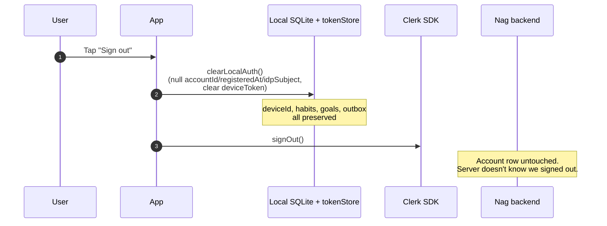

What's left after sign-out:

- Local: `deviceId` is preserved, replicated data is preserved, outbox
  is preserved. `accountId`/`idpSubject`/`registeredAt` are nulled and
  the device token is cleared.
- Server: nothing changes. The account row is still bound to the old
  `IdpSubject`. Other devices paired into the same account keep working.

## Sign in again — same identity

The cheapest case: same Clerk user, same device. The cold-start
short-circuit at `SignedInOrOut.tsx` line 101-112 (note: actual line
numbers may have drifted — search for `persisted.idpSubject`) skips
the upgrade round-trip once the local cache is rebuilt.

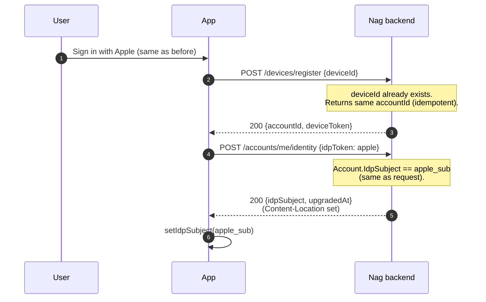

If the local `identity.idpSubject` was already populated on cold start
and matches Clerk's `user.id`, the app skips both round trips
entirely — the device is already known to be bound to that identity.

## Sign in with a _different_ identity after sign-out

**This is the flow PR #211 fixed.** After a soft sign-out, the server
still thinks the device's account is bound to the old identity. When
the user signs in with a new identity, `POST /accounts/me/identity`
returns a 409 with the message _"account is already bound to a
different identity"_, and the client routes to `runIdentityMismatch`
with three branches.

### The fork

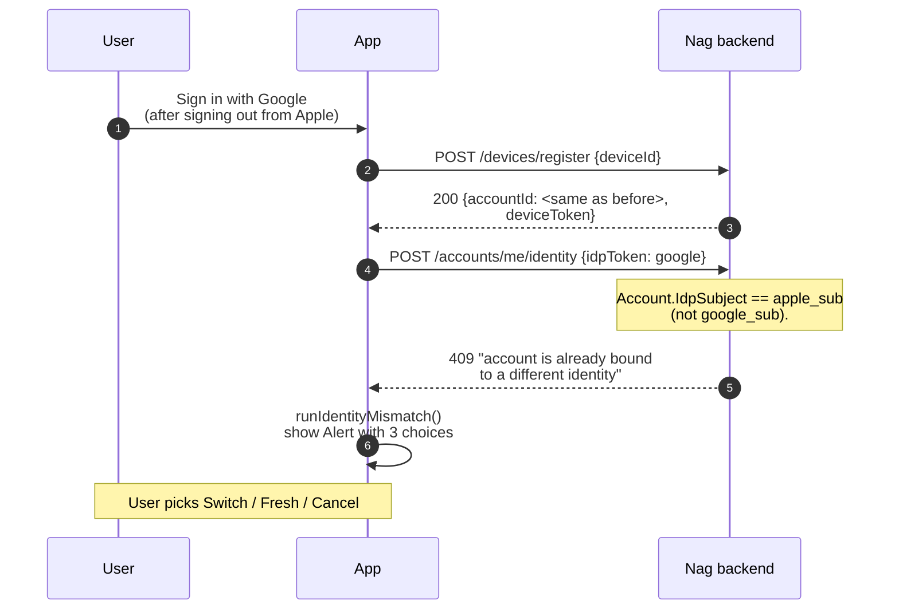

### Branch 1 — _Switch this account to this login_

Re-points the device's existing account at the new identity. The
account row, its data, and any other paired devices keep working.

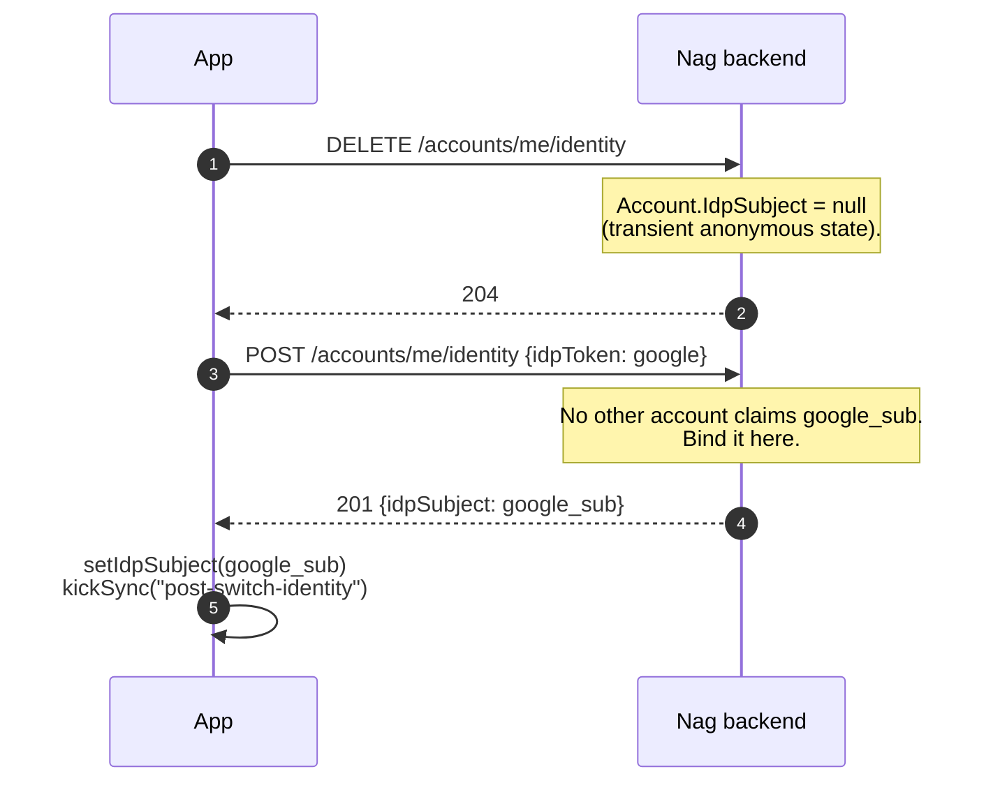

> The "transient anonymous state" in step 1 between DELETE and POST is
> the only window where the server holds an unbound account. If the
> POST fails, the next sign-in attempt with _any_ identity will succeed
> (a freshly anonymous account accepts any non-conflicting sub).

### Branch 2 — _Start a new account_

Abandons the existing account entirely. The server cascade-deletes
everything, then we re-bootstrap with a brand-new server account.
Local data is wiped — the user explicitly chose to start fresh.

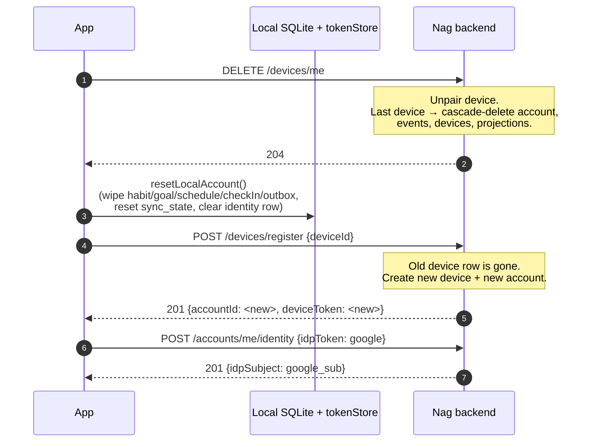

### Branch 3 — _Cancel_

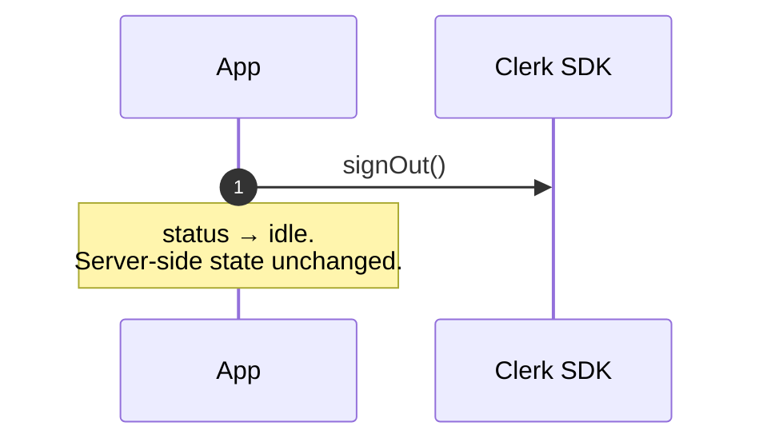

## Sign in with an identity that already owns _another_ account

A different 409 from the same endpoint, with the message _"this
identity is already bound to a different account"_. Typical trigger:
the user has another device paired to that identity, and this device
is on a fresh anonymous-account install. The client routes to
`runPairFallback` (the original sign-in conflict flow, pre-dates
PR #211).

### Branch — _Use server data_ (`runReplaceLocal`)

Pair this device into the existing account, wipe local replicated
tables so pull-sync rehydrates from the server snapshot.

### Branch — _Use this device's data_ (`runReplaceServer`)

Take over the identity from A_other and bind it to this device's
account. A_other is left anonymous on the server (transient — see
Branch 1 of runIdentityMismatch for the same pattern).

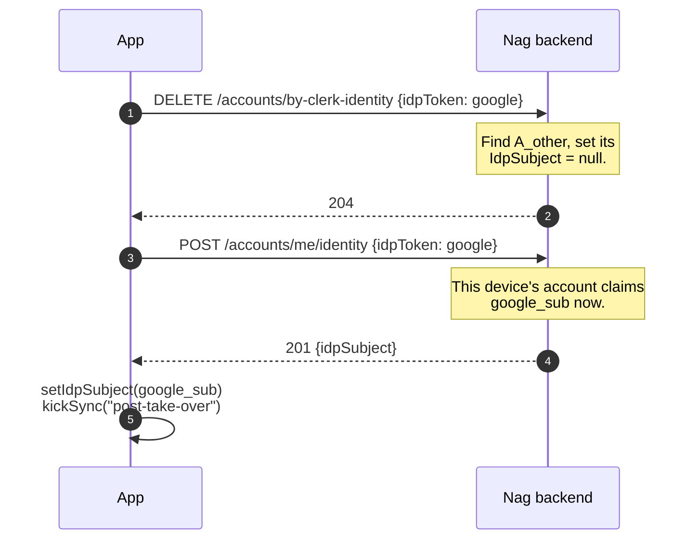

## Disconnect from cloud

The "I want to go local-only without losing my data" path. The
Account-screen action above _Delete account_. Wipes the server-side
account but keeps every habit, check-in, and outbox row on the device.

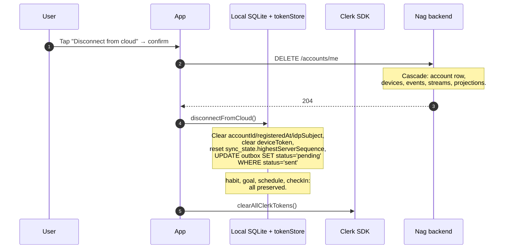

After this the device is genuinely anonymous (no server presence)
with all data intact. The app keeps working offline; the dispatcher
no-ops because `accountId` is null.

## Reconnect after disconnect

The follow-up: user signs in again later, with the same identity or
a new one. There's no server-side account to find (we deleted it), so
`POST /devices/register` creates a fresh one. The previously-sent
outbox rows — re-marked `'pending'` during disconnect — flush into the
new account, faithfully reconstructing the user's state.

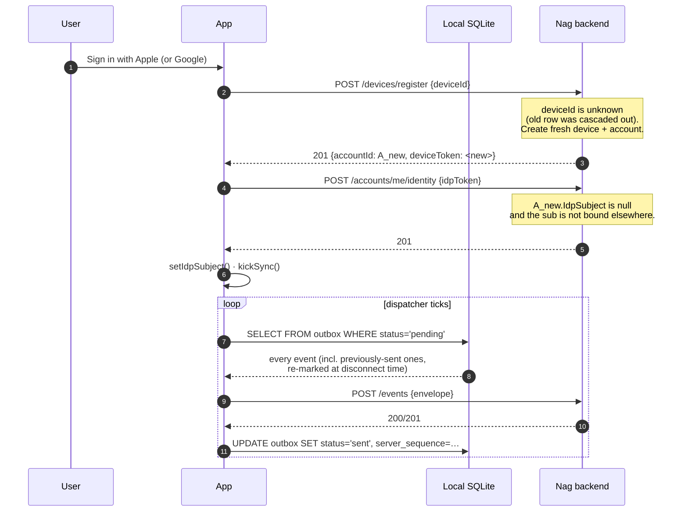

The envelope `id` of each outbox row is preserved across the
disconnect, so the re-ship hits the server's idempotency dedupe with
the same key. If the user has another (Google-bound) account
elsewhere and signs in with Google here, that's the
`runPairFallback` 409 case above — we don't end up doubling data,
the user picks server-or-device.

## Multi-device pairing

The "second device" flow. Same identity, fresh install on a new
phone. `/devices/pair` does the work — `/devices/register` would just
create a new anonymous account and we'd hit a 409 on upgrade
afterward, so the client goes to pair directly.

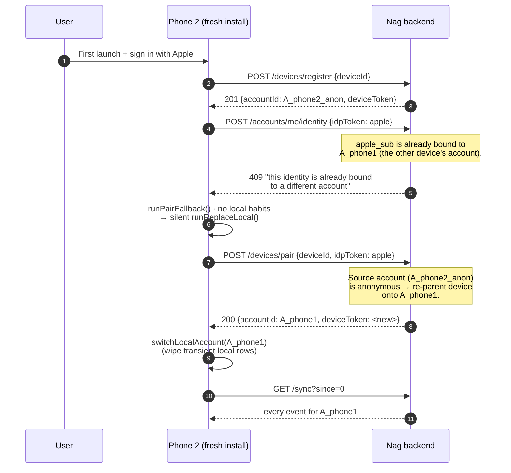

The silent `runReplaceLocal` branch fires because the second device
has nothing the user would mind losing — no habits yet — so the prompt
would just be friction.

## Delete account

The hard exit. Nuke the server account, wipe local SQLite, reset the
secure-store keys. The app reloads back to a fresh first-install state.

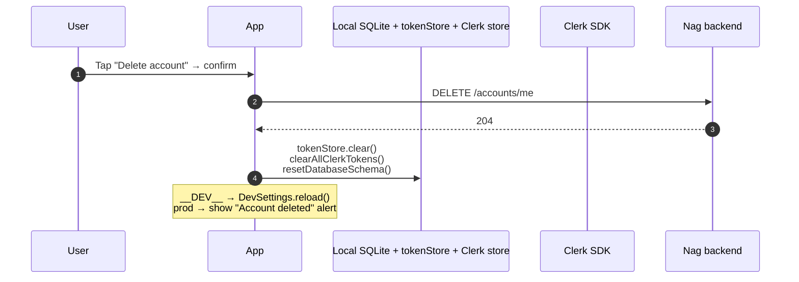

## Sign-in conflict decision tree

When `POST /accounts/me/identity` returns 409, the server's message
field discriminates the two cases. Match on substring; the messages
are documented and stable.

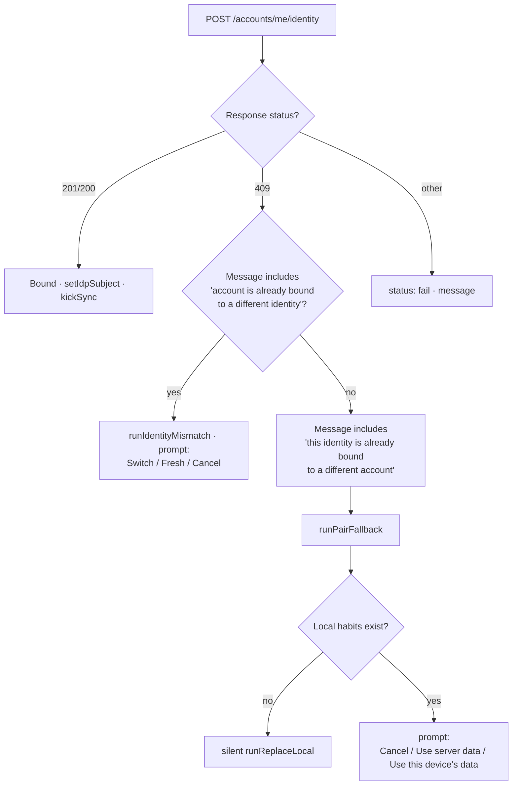

## Backend endpoint reference

| Verb     | Path                          | Auth                                         | Used by                                                     |
| -------- | ----------------------------- | -------------------------------------------- | ----------------------------------------------------------- |
| `POST`   | `/devices/register`           | none (anonymous)                             | First-launch register + the 401-refresh path                |
| `POST`   | `/devices/pair`               | none (anonymous; verifies IdP token in body) | `runReplaceLocal` (server-data branch)                      |
| `DELETE` | `/devices/me`                 | device token                                 | "Start a new account" branch of `runIdentityMismatch`       |
| `GET`    | `/devices/{id}`               | device token                                 | route only; not called from client                          |
| `POST`   | `/accounts/me/identity`       | device token                                 | First-time bind + re-bind after `Switch this account`       |
| `GET`    | `/accounts/me/identity`       | device token                                 | not currently called from client                            |
| `DELETE` | `/accounts/me/identity`       | device token                                 | `Switch this account` (unbind before re-POST)               |
| `DELETE` | `/accounts/by-clerk-identity` | device token + IdP token in body             | `runReplaceServer` (take-over branch)                       |
| `DELETE` | `/accounts/me`                | device token                                 | `confirmAndDeleteAccount` + `confirmAndDisconnectFromCloud` |

> See [#212](https://github.com/auctionready/nag/issues/212) for the
> proposed REST-correct shape: moving the device endpoints under
> `/accounts/me/devices`. Not blocking anything but tracked.

## State summary

The local `identity` row is the durable record of "what state is this
device in". Four reachable states:

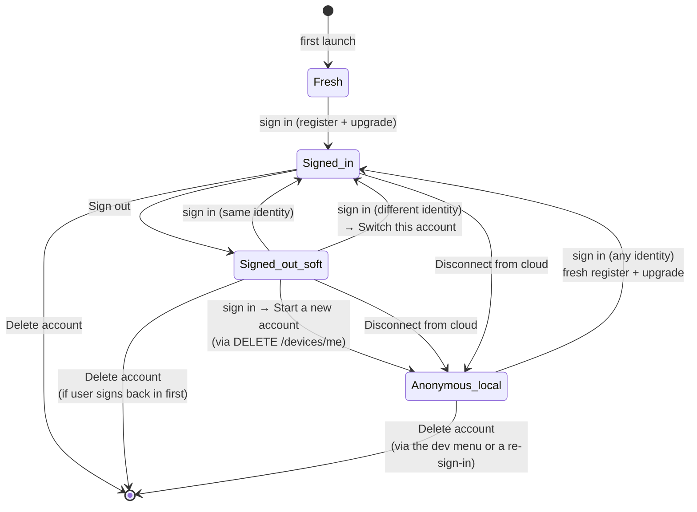

`Fresh` and `Anonymous_local` look the same from the device's
perspective — no `accountId`, no token, no server presence. The
difference is the presence of local data: `Anonymous_local` has habits
and an outbox carrying their history; `Fresh` is empty.
