# Identity, Auth, and Account Lifecycle

This doc covers everything authentication-related in the Nag stack —
the on-wire token shapes the server accepts, how each token is
verified, how tenant scoping falls out of the verified claims, and the
account-lifecycle flows that move a device between auth states.

Two halves:

1. **[How a request gets authenticated](#how-a-request-gets-authenticated)** —
   token shapes, the authentication handler, device HMAC + Clerk JWT
   verification, tenant resolution, token refresh, dev-auth bypass.
2. **[Account lifecycle flows](#account-lifecycle-flows)** — sign-in,
   sign-out, switching providers, disconnect-from-cloud, multi-device,
   delete account. Sequence diagram per flow.

If you're hunting for the implementation:

- **Server auth:** `backend/Nag.Api/Auth/NagAuthenticationHandler.cs` +
  `DeviceTokenService.cs` + `ClerkTokenVerifier.cs` +
  `DeviceAccountResolver.cs`.
- **Server registration:**
  `backend/Nag.Api/Configuration/AuthenticationExtensions.cs` (wires the
  scheme + verifiers + the memory cache) and
  `MartenExtensions.cs#AddMartenTenancyDetection` (links the
  `account_id` claim to Marten's conjoined tenancy).
- **Server endpoints:** `backend/Nag.Api/Endpoints/DevicesEndpoints.cs`
  - `AccountsEndpoints.cs`.
- **App-side orchestration:** `app/src/components/account/SignedInOrOut.tsx`
  - `app/src/components/account/conflictResolution.ts`.
- **Core helpers:** `packages/core/src/identity/identity.ts` —
  `ensureDeviceRegistered`, `refreshDeviceToken`, `clearLocalAuth`,
  `resetLocalAccount`, `disconnectFromCloud`, `switchLocalAccount`.
- **Token storage on device:** `app/src/infrastructure/tokenStore.ts`
  (Keychain on iOS / EncryptedSharedPreferences on Android via
  `expo-secure-store`) and `app/src/infrastructure/clerk.ts` (Clerk
  token cache).

# How a request gets authenticated

Every authenticated request carries `Authorization: Bearer <token>`.
The server's single ASP.NET Core authentication scheme inspects the
token shape, dispatches to one of two validators, and produces a
`ClaimsPrincipal` with an `account_id` claim that downstream code
(authorization, Marten tenancy, endpoint handlers) keys off.

## Token shapes

Two token types are accepted. They're disambiguated by dot count, not
by a prefix, so the wire is compact and the client doesn't have to
declare its auth method.

| Tokens          | Dots | Wire format                          | Issued by                                                                                  | Validated by                     |
| --------------- | ---- | ------------------------------------ | ------------------------------------------------------------------------------------------ | -------------------------------- |
| **Device HMAC** | 1    | `base64url(payload).base64url(hmac)` | the Nag server itself, on every successful `POST /devices` and `POST /accounts/me/devices` | `DeviceTokenService.Validate`    |
| **Clerk JWT**   | 2    | `header.payload.signature`           | Clerk (the IdP), as a session token issued to the mobile client                            | `ClerkTokenVerifier.VerifyAsync` |

`NagAuthenticationHandler.HandleAuthenticateAsync` reads the header,
strips the `Bearer ` prefix, counts dots, and dispatches. Anything
else 401s with `"token format not recognized"`. See
[`NagAuthenticationHandler.cs`](../backend/Nag.Api/Auth/NagAuthenticationHandler.cs#L41-L46).

## Device HMAC token

The post-pairing credential — every authenticated mobile request to
the API uses this, after the initial register/pair handshake.

**Payload (40 bytes, fixed):**

```
deviceId    : 16 bytes  (UUID, big-endian)
accountId   : 16 bytes  (UUID, big-endian)
expiryUnix  :  8 bytes  (int64, big-endian, seconds since epoch)
```

**Signature:** `HMACSHA256(secret, payload)` → 32 bytes.

**Wire:** `base64url(payload) "." base64url(mac)` — one dot. Big-endian
GUIDs were a deliberate choice for cross-platform stability
([`DeviceTokenService.cs`](../backend/Nag.Api/Auth/DeviceTokenService.cs#L86-L92)).

**Lifetime:** configured via `Nag:DeviceToken:Lifetime`. The token
expires; the client refreshes on 401 — see
[Token refresh on 401](#token-refresh-on-401).

**Secret rotation:** the HMAC secret comes from
`Nag:DeviceToken:Secret` (env `DEVICE_TOKEN_SECRET`). Rotating it
invalidates every issued token simultaneously and forces every device
through the refresh flow. There's no cross-secret grace period — the
refresh path on the client treats secret rotation and individual
expiry identically.

**Validation steps** ([`DeviceTokenService.Validate`](../backend/Nag.Api/Auth/DeviceTokenService.cs#L45-L82)):

1. Parse the dot-split shape; reject anything malformed.
2. Length-check both halves (40 + 32 bytes).
3. Recompute HMAC over the payload and compare in constant time
   (`CryptographicOperations.FixedTimeEquals`) so a forged MAC can't
   leak timing.
4. Decode `expiryUnix`; reject if `<= now`.

On success the handler builds a `ClaimsIdentity` with:

| Claim                                      | Value                                                            |
| ------------------------------------------ | ---------------------------------------------------------------- |
| `NagClaimTypes.AccountId` (`account_id`)   | the decoded accountId, formatted `D` (lowercase hex with dashes) |
| `NagClaimTypes.DeviceId` (`device_id`)     | the decoded deviceId, same format                                |
| `NagClaimTypes.AuthMethod` (`auth_method`) | `"device"`                                                       |

**Live-account check.** After a successful HMAC validation the handler
calls `IDeviceAccountResolver.AccountExists(accountId)` and fails the
authentication if the row is gone. Without this, an out-of-band
`DELETE /accounts/me` would leave the token authenticating against an
orphan tenant id and the dispatcher would happily append events under
that dead tenant. The resolver caches the boolean for 5 minutes, and
the delete endpoints (`/accounts/me`, `/devices/me`) explicitly call
`InvalidateAccount` after the cascade so the next request after
delete fails fast.

## Clerk JWT

Used only on the pre-pairing endpoints: `POST /accounts/me/identity`
(in some places — also accepts device tokens), `POST /accounts/me/devices`,
`DELETE /accounts/by-clerk-identity`. The mobile client gets it from
the Clerk SDK (`getToken()`).

**Validation** ([`ClerkTokenVerifier.cs`](../backend/Nag.Api/Auth/ClerkTokenVerifier.cs)):

- Pulls Clerk's JWKS from `{ClerkIssuer}/.well-known/openid-configuration`
  via `Microsoft.IdentityModel.Protocols.OpenIdConnect`. The
  `IConfigurationManager<OpenIdConnectConfiguration>` is a singleton
  with built-in refresh; we don't manage the JWKS cache directly.
- A hosted `JwksWarmupService` fetches the JWKS at startup so the
  first authenticated request after a cold Lambda boot doesn't have to
  pay the ~hundreds-of-ms metadata fetch.
- `JsonWebTokenHandler.ValidateTokenAsync` checks:
  - **Issuer** must equal `Nag:ClerkIssuer` (pinning the token to our
    Clerk instance).
  - **Signing key** must be one of the JWKS keys.
  - **Lifetime** with a 2-minute clock skew tolerance.
  - **Audience** is _not_ validated — Clerk session tokens don't
    always carry an `aud`, and the issuer pin already binds the token
    to this Nag instance.
- Returns the `sub` claim (`user_xxx`) on success.

**Resolving the account.** The handler then calls
`IDeviceAccountResolver.AccountIdForSubject(sub)` which queries
`SELECT id FROM accounts WHERE idp_subject = $sub` (Marten). Result
cached for 5 minutes. `null` (no account bound) fails the
authentication with `"no account is bound to this Clerk identity"`.

On success, the handler builds the `ClaimsIdentity` with:

| Claim                                      | Value                  |
| ------------------------------------------ | ---------------------- |
| `NagClaimTypes.Subject` (`sub`)            | the Clerk subject      |
| `NagClaimTypes.AccountId` (`account_id`)   | the resolved accountId |
| `NagClaimTypes.AuthMethod` (`auth_method`) | `"clerk"`              |

Note there's **no `device_id` claim** on Clerk-authenticated requests
— it doesn't exist yet (the device-token handshake is what assigns
one). Endpoints that need a deviceId require device-token auth.

## Authorization model

Authentication is mandatory by default. In
[`AuthenticationExtensions.cs`](../backend/Nag.Api/Configuration/AuthenticationExtensions.cs):

```csharp
builder.Services.AddAuthorization(opts =>
{
    // Every endpoint requires authentication unless explicitly [AllowAnonymous].
    opts.FallbackPolicy = opts.DefaultPolicy;
});
```

So the failure mode is opt-in-only — forgetting an attribute on a new
endpoint blocks the request, doesn't leak it. The bootstrap endpoints
explicitly opt out:

| Endpoint                    | Why anonymous                                                                       |
| --------------------------- | ----------------------------------------------------------------------------------- |
| `POST /devices`             | first contact; no token to present yet                                              |
| `POST /accounts/me/devices` | verifies an IdP token in the body instead — the caller has no device token          |
| `GET /health`               | liveness probe                                                                      |
| `GET /dev/token`            | local dev only; stripped from prod bundle (see [Dev-auth bypass](#dev-auth-bypass)) |

## Multi-tenancy: `account_id` → Marten

Every authenticated request carries an `account_id` claim. Marten's
conjoined tenancy is wired to read it directly:

```csharp
// MartenExtensions.cs
builder.Services.AddMartenTenancyDetection(opts =>
{
    opts.IsClaimTypeNamed(NagClaimTypes.AccountId);
});
```

The `IDocumentSession`/`IQuerySession` that gets injected into a
request handler is automatically tenanted by the caller's account.
Conjoined-tenant document types (`HomeBoard`, `CheckInState`,
`MonthlyCheckInSummary`, `WeeklyCheckInSummary`,
`HabitComplianceHistory`, `ProcessedEnvelope`) and the event store all
get a `WHERE tenant_id = $account_id` filter for free. Cross-tenant
reads are impossible by construction unless a handler explicitly opens
a `LightweightSession(tenantId)` against a different tenant (which
only happens in the cascade-delete paths, scoped to the _caller's own_
account).

A handful of endpoints don't operate on tenant-scoped data —
`/accounts/me`, `/accounts/me/identity`, `/devices/me`,
`/devices/me`, `/health`. These carry the `[NotTenanted]` attribute so
Marten's tenancy detection skips the claim lookup; they operate on the
single-tenant `Account` and `Device` document types (which are _how_
we find the tenant in the first place, so they can't themselves be
tenant-scoped).

## Token refresh on 401

The Zodios HTTP client wraps every request in an
`onUnauthorized` handler ([`apiClient.ts`](../app/src/infrastructure/apiClient.ts#L74-L90)):

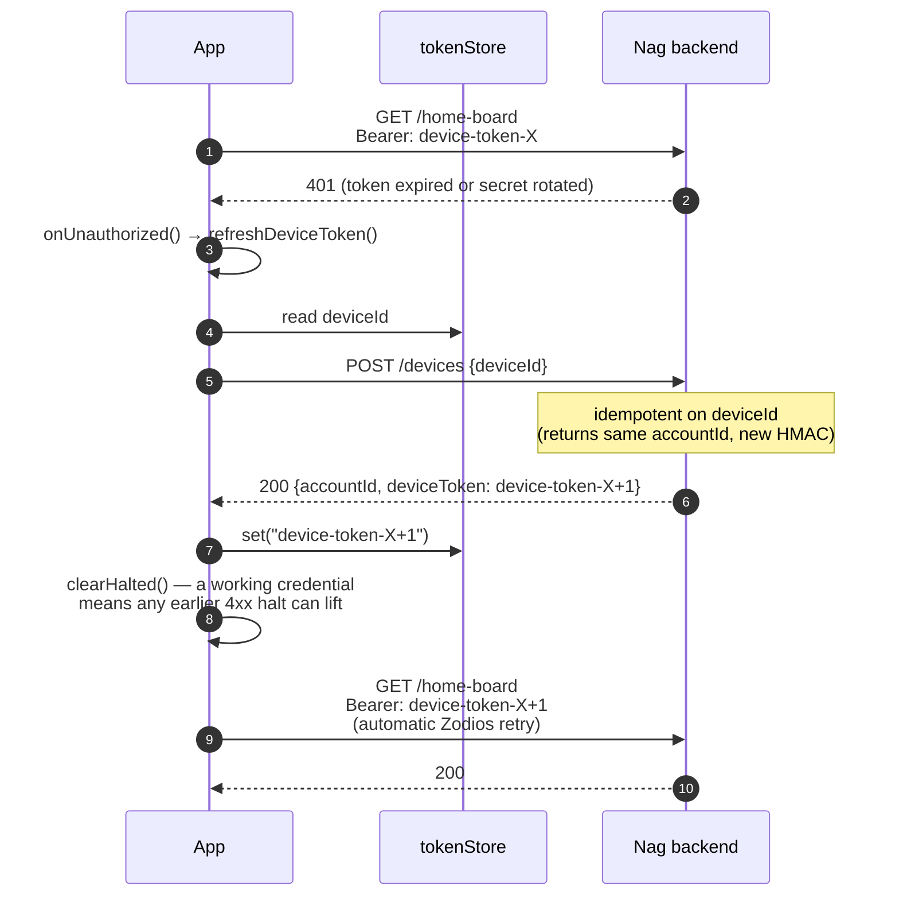

The refresh path reuses `POST /devices` because the endpoint is
idempotent on `deviceId` — re-registering an existing device returns
the same `accountId` paired with a freshly-signed token. If the
re-register itself fails the request gives up and propagates the 401
to the caller. There's no retry storm — Zodios only retries the
original request once after a successful refresh.

## Dev-auth bypass

For local development and the Swagger UI, a parallel `GET /dev/token`
endpoint mints a device HMAC bound to a fixed dev account+device GUID
pair (no Clerk involvement). The Swagger UI's pre-request interceptor
calls it on first request and stores the token, so "Try it out" works
without any sign-in ceremony.

**Strict prod safety:** the dev-auth endpoint and `SwaggerDevAuth`
class are compiled with `#if DEBUG` so they're stripped from the
release bundle entirely. The OpenAPI generator runs against the Debug
build (see `backend/scripts/generate-openapi.sh`), so the dev-auth
operations appear in the local spec but not in any prod-deployed
artifact.

On the mobile side `packages/core/src/identity/devAuth.ts` provides
an `ensureDevAuthRegistered` analogue of `ensureDeviceRegistered` that
hits `/dev/token` instead of going through Clerk. Wired up in
`DevAuthAccountPanel.tsx`. The whole module tree is gated by
`__DEV__` so it doesn't ship to prod either.

## Server endpoint reference

| Verb              | Path                          | Auth                             | `[NotTenanted]` | Used by                                                         |
| ----------------- | ----------------------------- | -------------------------------- | --------------- | --------------------------------------------------------------- |
| `POST`            | `/devices`                    | anonymous                        | ✓               | First-launch register + the 401-refresh path                    |
| `POST`            | `/accounts/me/devices`        | anonymous (IdP token in body)    | ✓               | `runReplaceLocal` (server-data branch)                          |
| `GET`             | `/devices/me`                 | device token                     | —               | route only; not called from client                              |
| `DELETE`          | `/devices/me`                 | device token                     | ✓               | "Start a new account" branch of `runIdentityMismatch`           |
| `POST`            | `/accounts/me/identity`       | device token                     | ✓               | First-time bind + re-bind after `Switch this account`           |
| `GET`             | `/accounts/me/identity`       | device token                     | ✓               | not currently called from client                                |
| `DELETE`          | `/accounts/me/identity`       | device token                     | ✓               | `Switch this account` (unbind before re-POST)                   |
| `DELETE`          | `/accounts/by-clerk-identity` | device token + IdP token in body | ✓               | `runReplaceServer` (take-over branch)                           |
| `DELETE`          | `/accounts/me`                | device token                     | ✓               | `confirmAndDeleteAccount` + `confirmAndDisconnectFromCloud`     |
| `GET`             | `/dev/token`                  | anonymous (DEBUG only)           | ✓               | dev-auth panel + Swagger UI auto-authorize                      |
| `GET`             | `/health`                     | anonymous                        | ✓               | liveness probe                                                  |
| (everything else) | various                       | device token                     | tenanted        | normal authenticated endpoints — events, sync, home-board, etc. |

The pair endpoint sits under `/accounts/me/devices` rather than
`/devices/pair` because POST-to-a-collection is the canonical "create a
new member" shape; the `me` is resolved from the body-borne `idpToken`
the same way `DELETE /accounts/by-clerk-identity` does. The register
endpoint stays at the collection root `/devices` because no owning
account exists yet (it's the call that mints one).

# Account lifecycle flows

The rest of this doc walks through the user-facing states a device
moves between: how it first contacts the server, how it leaves a
signed-in state in any of four different ways, and how a subsequent
sign-in finds its way back.

## Mental model

Three entities matter; pin these down before tracing any flow.

| Entity           | Lives where                                                              | Identity                                                                                        |
| ---------------- | ------------------------------------------------------------------------ | ----------------------------------------------------------------------------------------------- |
| **Device**       | one row server-side + one matching row in `identity` locally             | `deviceId` (UUID, generated locally on first launch, never changes for the life of the install) |
| **Account**      | one row server-side; mirror of its `accountId` in local `identity`       | `accountId` (UUID, generated server-side on first contact)                                      |
| **IdP identity** | Clerk-managed; the server stores it as `Account.IdpSubject` (`user_xxx`) | the `sub` claim of a verified Clerk JWT                                                         |

A device authenticates server requests with a **device HMAC token**
(`{accountId, deviceId}` signed by the server). The IdP token is only
ever used to bind/unbind identity and to pair new devices.

Two other pieces of local state matter:

- **`outbox`** — past-tense events the local app has committed but the
  server hasn't acked yet. The dispatcher ships rows where
  `status='pending'` against the current `accountId`. `'sent'` rows are
  retained for replay (`NAG_SENT_OUTBOX_RETAIN=-1` by default).
- **`sync_state.highestServerSequence`** — high-water mark for pull-sync.
  Reset to 0 when the device moves to a brand-new server account.

> **Anonymous = local only.** The server never persists an account
> without an `IdpSubject` bound to it (a brand-new
> `POST /devices` row is bound the same request via
> `/accounts/me/identity`). "Anonymous" in this doc always refers to a
> device with no server state at all — purely local data.

## Exits from a signed-in state

There are **three** ways to step away from a signed-in state, only
two of which actually sign out. They differ on what they preserve
server-side, locally, and in the Clerk session.

| Exit                                           | Server account    | Server data | Local data + outbox                                                                                                                                                                                                     | Clerk session   |
| ---------------------------------------------- | ----------------- | ----------- | ----------------------------------------------------------------------------------------------------------------------------------------------------------------------------------------------------------------------- | --------------- |
| **Sign out → Remove server data and sign out** | deleted (cascade) | deleted     | local `identity` cleared (`accountId`/`idpSubject`/token); `deviceId` preserved; `sync_state.highestServerSequence` reset; habit/goal/schedule/checkIn **preserved**, every `'sent'` outbox row reverted to `'pending'` | signed out      |
| **Sign out → Pause server sync**               | preserved         | preserved   | nothing touched — `sync_state.paused = true` is the only mutation. Outbox keeps queueing new events; the dispatcher + pull-sync short-circuit on their next tick                                                        | **stays alive** |
| **Delete account**                             | deleted (cascade) | deleted     | wiped on next launch via `resetDatabaseSchema()`                                                                                                                                                                        | signed out      |

`Sign out` is exposed as a single button on the Account screen that
opens a three-option dialog (Cancel / Remove server data and sign out
/ Pause server sync). The two non-Cancel options reflect very
different intents:

- _Remove server data and sign out_ is the full exit — the server
  account is destroyed (cascading every device, event, projection),
  the local binding is torn down, Clerk is signed out. Local habits +
  outbox stay so the user can keep working; the next sign-in (any
  provider) registers a fresh server account and the outbox flushes
  the queued history into it. The server-delete is what makes signing
  back in with a _different_ provider work cleanly — without it the
  original account would orphan, holding the old identity in place
  and triggering a `runPairFallback` prompt on every subsequent
  sign-in.
- _Pause server sync_ is a reversible stop. `sync_state.paused = true`
  causes the dispatcher + pull-sync to short-circuit on their next
  tick, but nothing else changes: server account stays, Clerk session
  stays, local data and outbox stay (the outbox keeps queueing new
  events from in-app activity). Resume is the Account-screen banner,
  which clears the flag and flushes whatever backlog accumulated. The
  point is to give the user a calm "I don't want to think about the
  cloud right now" affordance that doesn't burn the cloud
  relationship.

The previous "soft sign-out" pattern (clear local token, keep
`deviceId`, leave server alone) is intentionally gone — a leftover
`deviceId` + still-alive server account + no Clerk session was a
takeover vector: any subsequent caller of `POST /devices`
with the same id would idempotently receive an HMAC for the original
account with no proof of ownership. _Remove server data and sign out_
closes the hole by deleting the server-side row that the residual
`deviceId` would have authenticated against; _Pause server sync_
closes it by keeping Clerk alive (the device remains
authenticated-as-the-user the whole time, no anonymous re-register
window opens).

## Sign-in flow on a fresh device

Anonymous local state, never contacted the server. User signs in with
Clerk for the first time. The happy path: register a server account
and bind it to the verified identity in one ceremony.

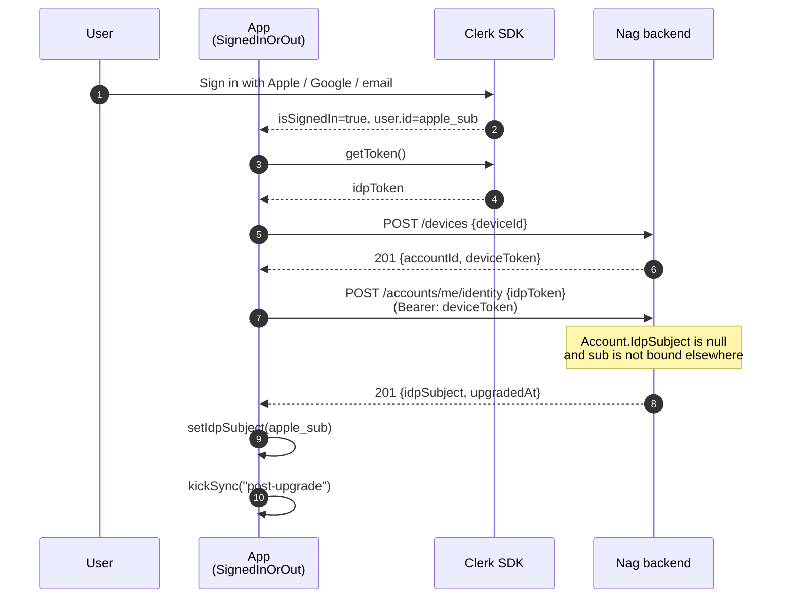

After this, the local `identity` row is fully populated (`deviceId`,
`accountId`, `idpSubject`), the token store has a valid device HMAC,
and the dispatcher can start shipping any locally-queued events
(e.g. habits the user created while offline).

## Sign-out — the three-choice dialog

Tapping _Sign out_ on the Account screen presents an `Alert` with
three options. Cancel does nothing. The other two are very different:
one fully tears down the cloud relationship, the other just halts the
sync loop until the user clicks Resume.

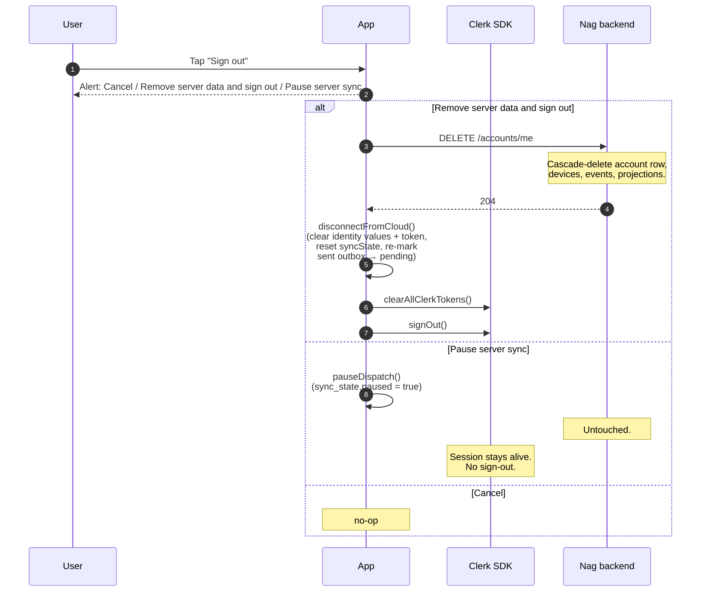

What changes, per branch:

|                                     | Server account | Local data + outbox                               | Clerk session   | How user comes back                             |
| ----------------------------------- | -------------- | ------------------------------------------------- | --------------- | ----------------------------------------------- |
| **Remove server data and sign out** | gone           | preserved; sent→pending re-mark drives re-ship    | signed out      | sign in again — outbox flushes to a new account |
| **Pause server sync**               | preserved      | preserved; outbox keeps queueing during the pause | **stays alive** | tap "Resume sync" on the Account-screen banner  |

**Why _Remove server data and sign out_ deletes the server-side
account:** if we left it alive while preserving the local data, a
subsequent `POST /devices` with the still-valid local
`deviceId` (after Clerk had signed out) would return a fresh HMAC
for the original account — letting whoever was next at the device
read and own everything. The cascade-delete is what makes preserving
the local data safe.

**Why _Pause server sync_ doesn't sign out of Clerk:** if we ended the
Clerk session, the takeover vector above re-opens — anonymous
`POST /devices` would let any caller claim the account.
Keeping Clerk live means the device stays authenticated-as-the-user
the whole pause; the dispatcher just refuses to ship. Resume flips
the flag back; nothing else needs to happen.

**The `paused` flag.** Lives on `sync_state` (single-row table).
`isPaused(db)` is checked by both the outbox dispatcher and pull-sync
right after `isHalted` — halted takes priority so any 4xx error
surfaces in the UI ahead of any "you paused me" affordance. Resume
clears _both_ flags in a single transaction (along with flipping any
`failed` outbox rows back to `pending` for retry), so a single Resume
button on the banner covers both stop paths.

## Sign in again — same identity, after _Remove server data and sign out_

Branch: outbox re-ship into a brand-new server account. The user
signed out keeping their data; they sign back in (any identity, but
let's draw the same-identity case). Local has habits + a primed
outbox of `'pending'` events.

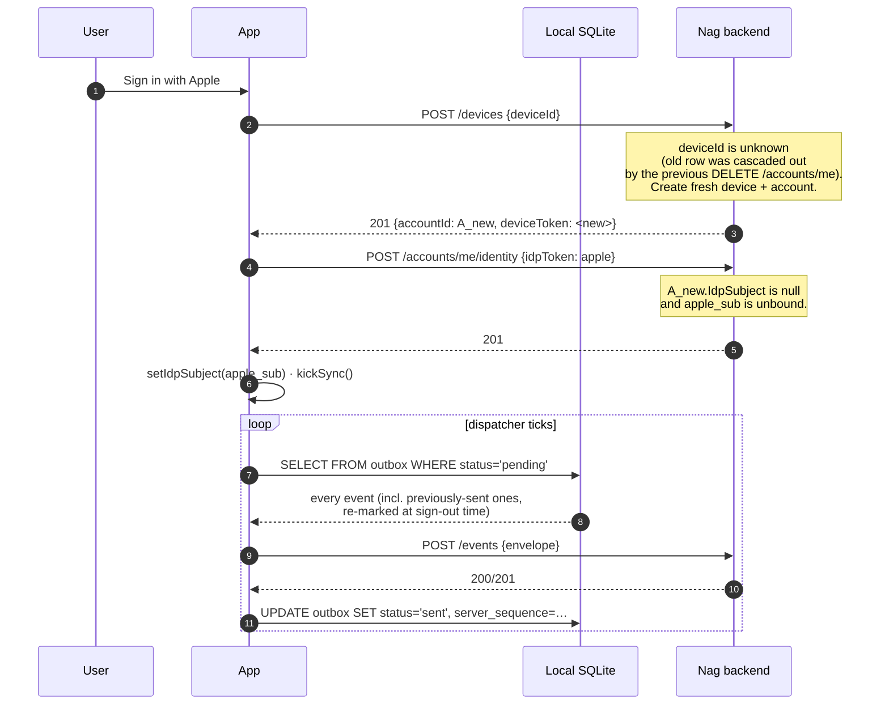

The envelope `id` of each outbox row is preserved across the
sign-out so the re-ship still hits the server's idempotency dedupe
with the same key. If the chosen identity belongs to an existing
account elsewhere (e.g. Alice has another device that's still on
A_other) the upgrade returns 409 and we fall into the pair-fallback
flow described below — and the user picks whether to push local data
up or pull server data down.

## Resume after _Pause server sync_

No re-sign-in needed. The Account screen renders a calm "Sync paused"
banner whenever `sync_state.paused = true`; tapping _Resume sync_
calls `resumeDispatch(db)` (the same helper the
red "Not syncing right now" banner uses for halt recovery), which in
a single transaction clears `paused`, clears `halted`, and flips any
`'failed'` outbox rows back to `'pending'`. Then a kick fires the
dispatcher immediately so the backlog drains without waiting on the
safety timer.

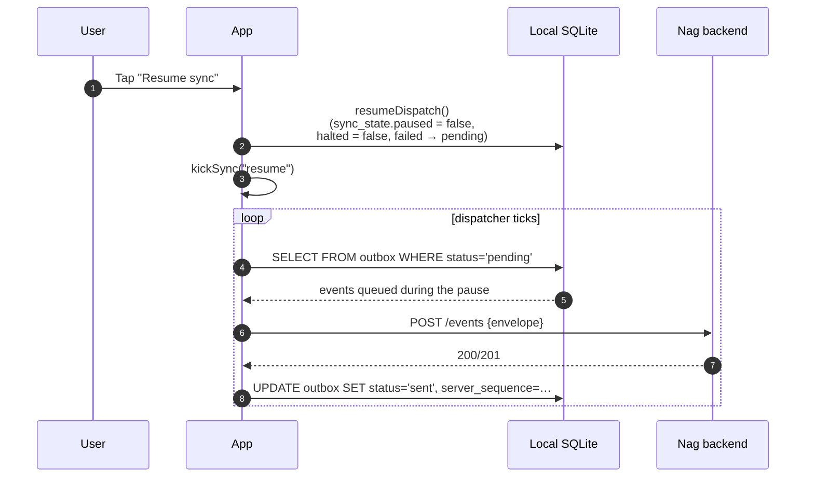

Pause doesn't disturb the outbox at all — new events created while
paused get appended as `'pending'` rows the same way they would
during normal operation, and they ship in order on resume. The Clerk
session never closed, so the device token still authenticates the
ship.

## Sign in with an identity that already owns _another_ account

The classic multi-device-style 409: this device's freshly-registered
anonymous account collides with an identity that's already bound to
an account elsewhere. The client routes to `runPairFallback`.

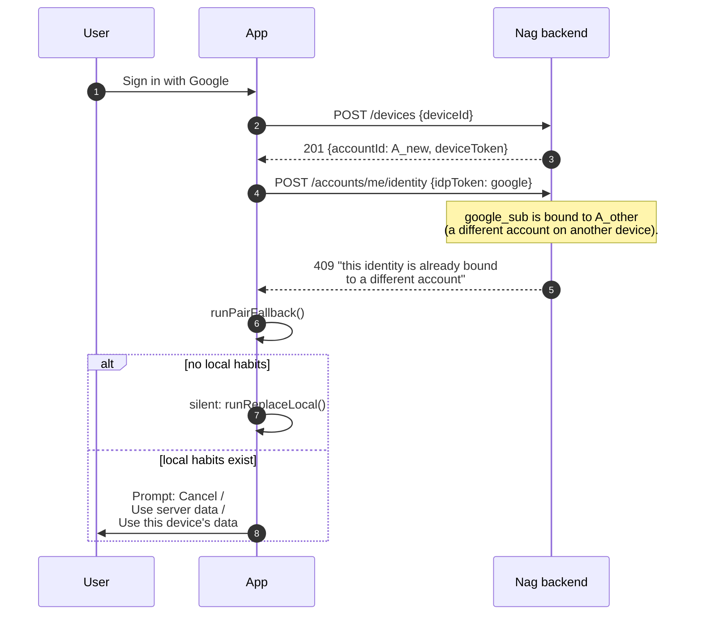

### Branch — _Use server data_ (`runReplaceLocal`)

Pair this device into the existing account, wipe local replicated
tables so pull-sync rehydrates from the server snapshot.

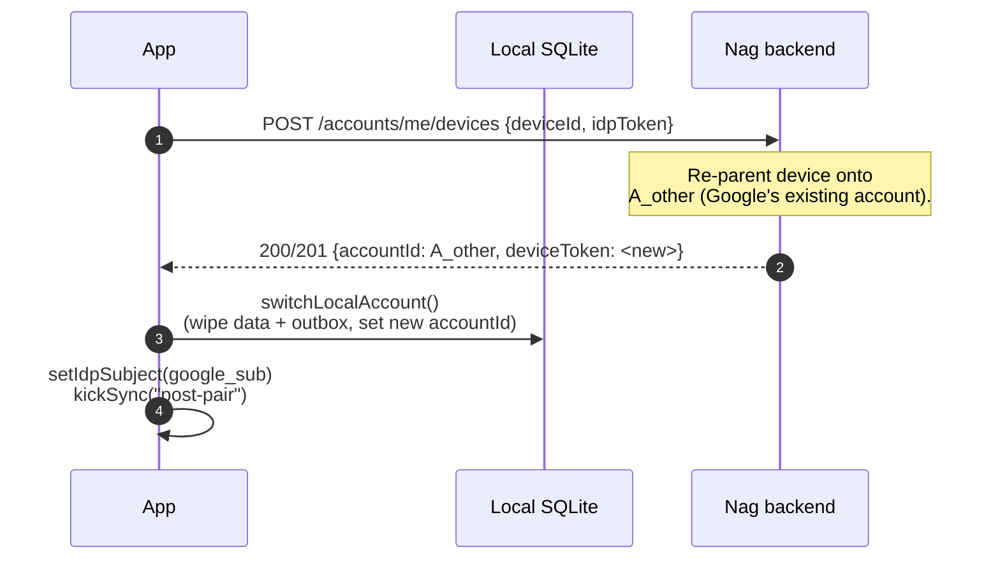

### Branch — _Use this device's data_ (`runReplaceServer`)

Take over the identity from A_other and bind it to this device's
account. A_other is left anonymous on the server (transient).

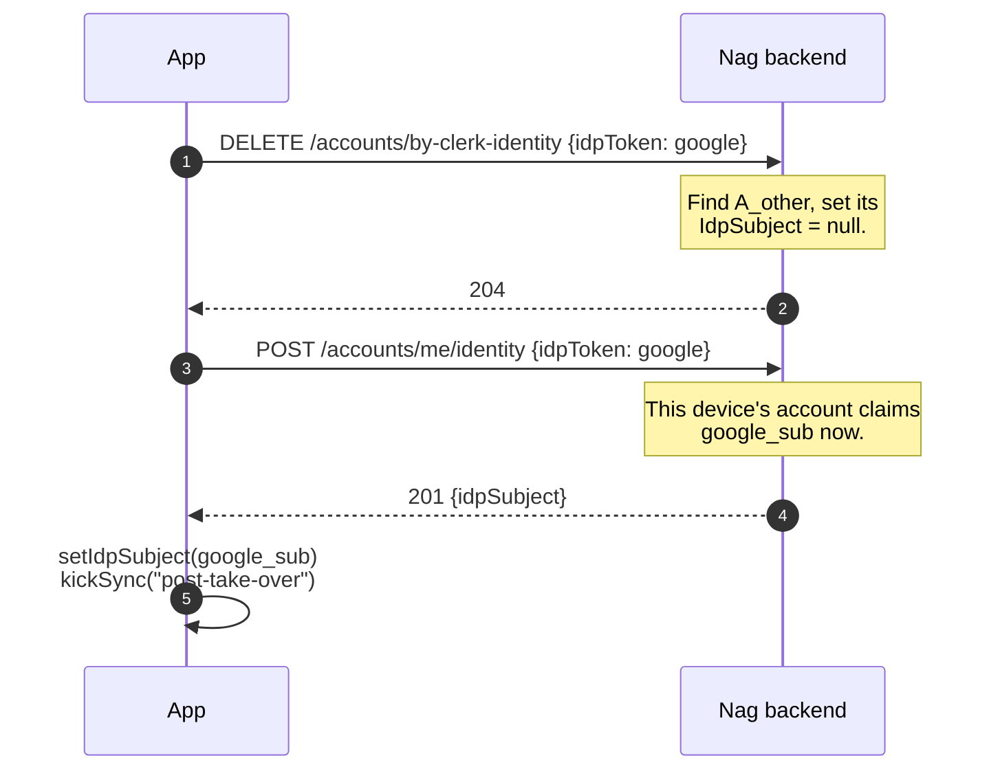

## Multi-device pairing

Same identity, fresh install on a second phone. `runPairFallback`'s
silent branch does the work because the second device has no local
habits to lose.

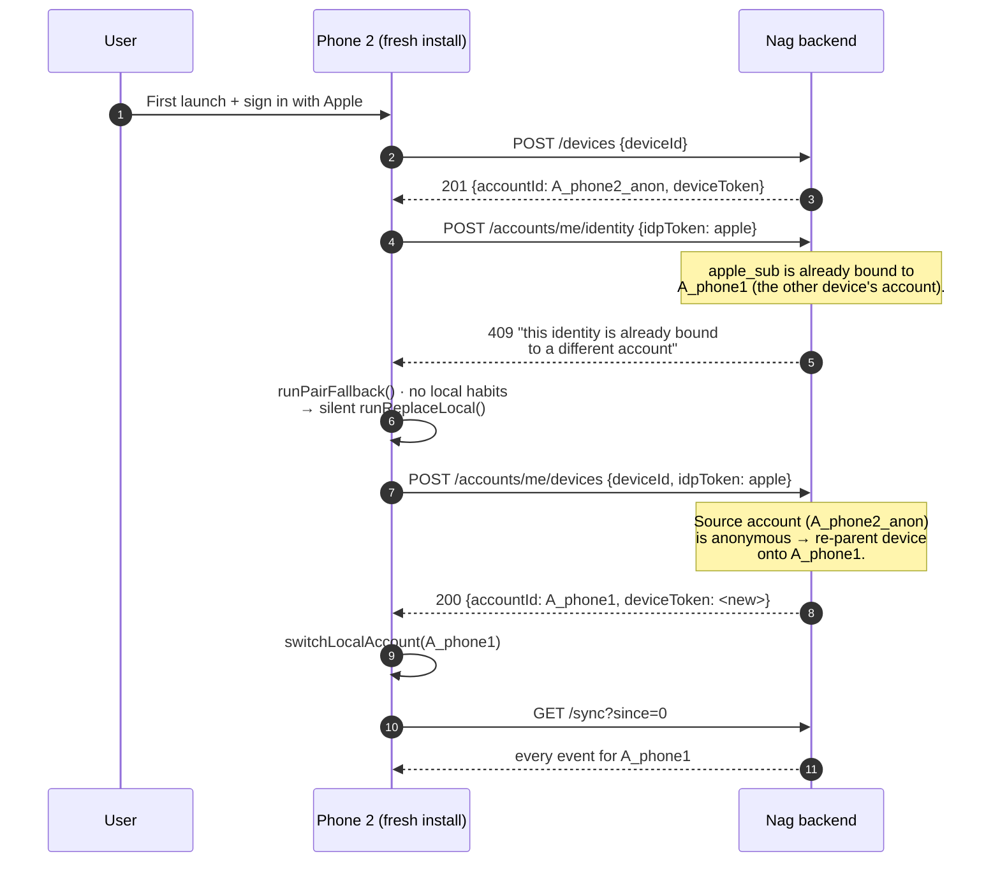

## Delete account

The hard exit. Nuke the server account, wipe local SQLite, reset the
secure-store keys. The app reloads back to a fresh first-install
state. Distinct from _Sign out → Sign out completely_ in that **both
sides** are destroyed (no recovery via re-sign-in).

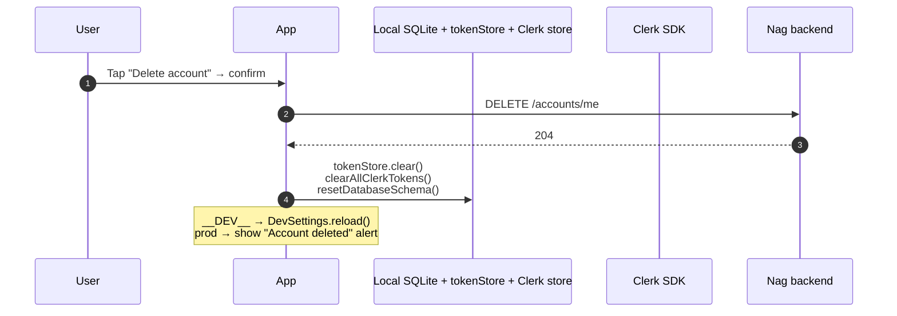

## Sign-in conflict decision tree

`POST /accounts/me/identity` returns a 409 in exactly one situation
now: the verified Clerk sub is already bound to another account
somewhere. (The previous "account is bound to a different identity"
409 is impossible because _Remove server data and sign out_ deletes
the old server account, so the next sign-in's upgrade runs against
a freshly-registered, unbound account — there's no old identity
binding left to conflict with.)

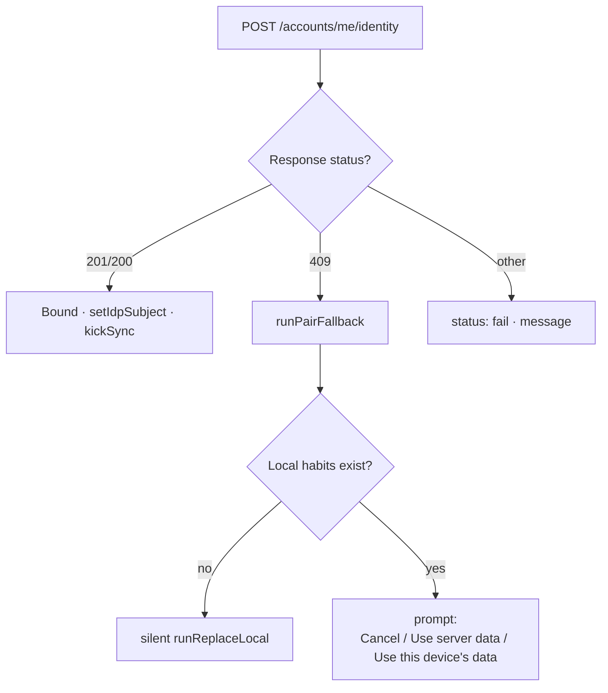

## Backend endpoint reference

| Verb     | Path                          | Auth                             | Used by                                                                                                                 |
| -------- | ----------------------------- | -------------------------------- | ----------------------------------------------------------------------------------------------------------------------- |
| `POST`   | `/devices`                    | anonymous                        | First-launch register + the 401-refresh path                                                                            |
| `POST`   | `/accounts/me/devices`        | anonymous (IdP token in body)    | `runReplaceLocal` (server-data branch of pair-fallback)                                                                 |
| `GET`    | `/devices/me`                 | device token                     | route only; not called from client                                                                                      |
| `DELETE` | `/devices/me`                 | device token                     | **gated by `#if RESERVED_ENDPOINTS`** — not compiled into any build by default                                          |
| `POST`   | `/accounts/me/identity`       | device token                     | First-time identity bind                                                                                                |
| `GET`    | `/accounts/me/identity`       | device token                     | named-route target for the `Location` / `Content-Location` headers on `POST /accounts/me/identity`; not called directly |
| `DELETE` | `/accounts/me/identity`       | device token                     | **gated by `#if RESERVED_ENDPOINTS`** — not compiled into any build by default                                          |
| `DELETE` | `/accounts/by-clerk-identity` | device token + IdP token in body | `runReplaceServer` (take-over branch of pair-fallback)                                                                  |
| `DELETE` | `/accounts/me`                | device token                     | `confirmAndDeleteAccount` + `confirmAndSignOut` (the _Keep on this device_ branch)                                      |

The two `RESERVED_ENDPOINTS`-gated entries (`DELETE /devices/me`,
`DELETE /accounts/me/identity`) are wrapped in `#if RESERVED_ENDPOINTS`
in `DevicesEndpoints.cs` and `AccountsEndpoints.cs` — the symbol is
**not defined by default**, so they don't compile in any build, don't
get registered with Wolverine at startup (no cold-start cost, no
entry in the route table), and don't show up in the generated
OpenAPI document. The matching test methods carry the same gate so
they come back together with the endpoints. To revive: `dotnet build
-p:DefineConstants=RESERVED_ENDPOINTS` (or set it in the csproj
during development), then re-run `pnpm --filter @nag/api-client
generate` to regenerate the typed Zodios client.

## State summary

Three reachable states plus a `Paused` sub-state of `Signed_in`.
`Paused` is a flag (`sync_state.paused`), not a separate identity
state — the device is still signed in to Clerk and the server, the
dispatcher just refuses to ship. `Anonymous_local` is "no server
binding at all"; `Fresh` is the first-install variant of the same
shape.

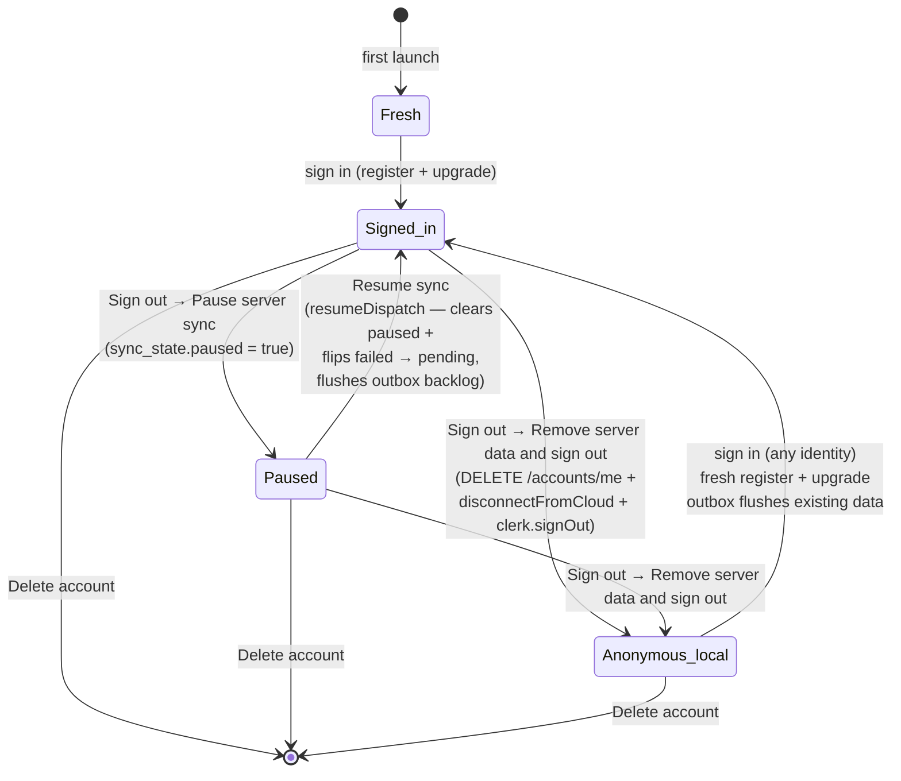

`Fresh` is the first-install state — no identity row, no local data,
no server presence. `Anonymous_local` is reached by _Sign out →
Remove server data and sign out_: local data and outbox preserved,
no server presence at all, app usable offline indefinitely; the next
sign-in registers a fresh server account that the outbox flushes
into. `Paused` is reached by _Sign out → Pause server sync_:
identity row untouched, Clerk session still alive, dispatcher +
pull-sync both refuse to run until the user taps Resume.
