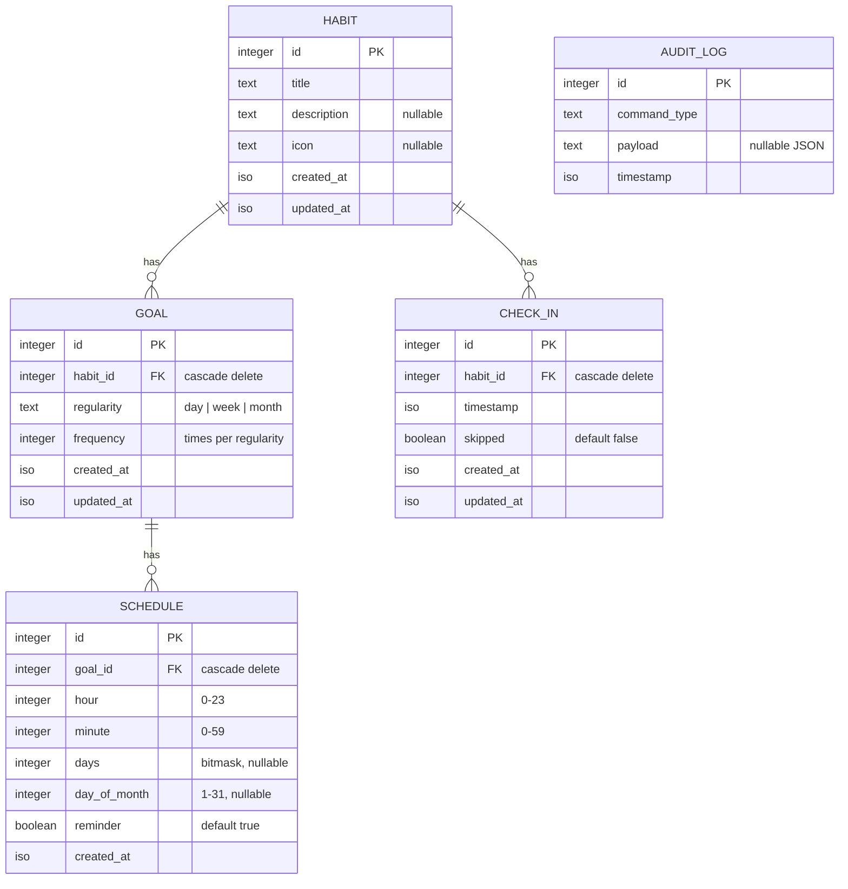

# Data Model

The app stores its data in a local SQLite database managed by Drizzle ORM.
Schema definitions live in [`packages/schema/src`](../packages/schema/src) and
relations in [`relations.ts`](../packages/schema/src/relations.ts).

## Schema Diagram

The diagram below is written in [Mermaid](https://mermaid.js.org/) — it
renders inline on GitHub and is still perfectly readable as plain text in the
source of this file.

`AUDIT_LOG` is intentionally drawn standalone — it records every command the
domain layer processes but has no foreign keys into the rest of the model.

## Tables

### `habit`

Source: [`habit.ts`](../packages/schema/src/habit.ts)

The thing you want to do. Title is required; description and icon are
optional. Created and updated timestamps are set automatically.

### `goal`

Source: [`goal.ts`](../packages/schema/src/goal.ts)

How often you want to perform a habit. `regularity` is one of `day`, `week`,
or `month`, and `frequency` is the number of times per that period (e.g.
`frequency = 3, regularity = "week"` reads as "3x weekly").

Constraints:

- `habit_id` references `habit.id` with `ON DELETE CASCADE`.
- Unique index on `(habit_id, regularity)` — a habit can only have one goal
  per regularity.
- Index on `habit_id` for lookup by habit.

### `check_in`

Source: [`checkIn.ts`](../packages/schema/src/checkIn.ts)

A record that a habit was performed (or explicitly skipped) at a given
`timestamp`. `skipped = true` marks it as a deliberate skip rather than a
completion.

Constraints:

- `habit_id` references `habit.id` with `ON DELETE CASCADE`.
- Indexes on `habit_id` and `timestamp`.

### `schedule`

Source: [`schedule.ts`](../packages/schema/src/schedule.ts)

When to remind the user about a goal.

- `hour` / `minute` — time of day.
- `days` — bitmask of weekdays (nullable). Bits are defined in
  [`packages/core/src/days.ts`](../packages/core/src/days.ts):
  `Sun = 1, Mon = 2, Tue = 4, Wed = 8, Thu = 16, Fri = 32, Sat = 64`.
- `day_of_month` — specific day (1-31) for monthly schedules, nullable.
- `reminder` — whether a notification fires (defaults to true).

Constraints:

- `goal_id` references `goal.id` with `ON DELETE CASCADE`.
- Index on `goal_id`.

### `audit_log`

Source: [`auditLog.ts`](../packages/schema/src/auditLog.ts)

An append-only log of commands processed by `@nag/core`. `command_type` is a
string identifier (e.g. `CreateHabit`), and `payload` is an optional JSON
string with the command's arguments. Useful for debugging and replaying
user actions.

## Relations

Drizzle relations are declared in
[`relations.ts`](../packages/schema/src/relations.ts):

- `habit` has many `check_in`s and many `goal`s.
- `check_in` belongs to one `habit`.
- `goal` belongs to one `habit` and has many `schedule`s.
- `schedule` belongs to one `goal`.

Deleting a habit cascades to its goals, check-ins, schedules (via goal), and
ultimately removes all dependent records.
