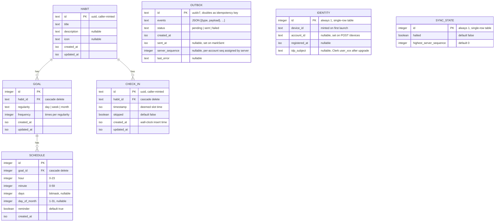

# Data Model

The app stores its data in a local SQLite database managed by Drizzle ORM.
Schema definitions live in
[`packages/schema/src/tables`](../packages/schema/src/tables) and relations
in [`tables/relations.ts`](../packages/schema/src/tables/relations.ts).

Caller-minted primary keys (`habit.id`, `check_in.id`, `outbox.id`) are
UUIDv7s generated by
[`seqUuid`](../packages/schema/src/seqUuid.ts) and stored as 16-byte BLOBs
via the [`uuid`](../packages/schema/src/columns/uuid.ts) custom type — the
JS surface stays as canonical 36-char strings, so call sites and wire
formats are unchanged.

## Schema Diagram

The diagram below is written in [Mermaid](https://mermaid.js.org/) — it
renders inline on GitHub and is still perfectly readable as plain text in the
source of this file.

`OUTBOX`, `IDENTITY`, and `SYNC_STATE` are intentionally drawn
standalone — none have foreign keys into the rest of the model.
`OUTBOX` queues every committed user-intent envelope (one row,
one-or-more past-tense events); `IDENTITY` and `SYNC_STATE` are
single-row metadata tables.

## Tables

### `habit`

Source: [`tables/habit.ts`](../packages/schema/src/tables/habit.ts)

The thing you want to do. Title is required; description and icon are
optional. Created and updated timestamps are set automatically.

`archived_at` and `paused_at` are nullable lifecycle timestamps:

- **Archived** (`archived_at` set) — hidden from the main board (still
  reachable via Accounts → Archived Habits) and dropped from the schedule.
- **Paused** (`paused_at` set) — dropped from the schedule and demoted on
  the board (listed last, greyed out, still openable).

Check-in rules: an **archived** habit is read-only (no check-ins or
skips). A **paused** habit stops accruing from the moment it was paused —
you can back-fill a check-in whose deemed time predates `paused_at`, but
nothing from the pause onward (the detail footer's picker is capped at
`paused_at`, and `CreateCheckIn` enforces it). Archive is a superset of
pause's schedule removal; unarchiving clears **both** flags, returning the
habit to active.

Lifecycle events: `HabitArchived`, `HabitUnarchived`, `HabitPaused`,
`HabitUnpaused` (each carries just `habitId`). Valid transitions:

- **pause** — only when not paused and not archived
- **unpause** — only when paused (and not archived)
- **archive** — only when not archived
- **unarchive** — only when archived

This is enforced in two layers, both client-side:

- The UI only offers valid actions — the `HabitActions` menu
  ([`components/habit-actions`](../app/src/components/habit-actions)) omits
  actions that don't apply.
- The **command handlers** ([`commands/handlers`](../packages/core/src/commands/handlers))
  read the habit's current flags and emit the event only for a valid
  transition (e.g. an `ArchiveHabit` on an already-archived habit emits
  nothing). This makes the commands idempotent without throwing.

The server doesn't validate these events — events are immutable facts it
appends and projects, so the check belongs on the command, not the event.

### `goal`

Source: [`tables/goal.ts`](../packages/schema/src/tables/goal.ts)

How often you want to perform a habit. `regularity` is one of `day`, `week`,
or `month`, and `frequency` is the number of times per that period (e.g.
`frequency = 3, regularity = "week"` reads as "3x weekly").

Constraints:

- `habit_id` references `habit.id` with `ON DELETE CASCADE`.
- Unique index on `(habit_id, regularity)` — a habit can only have one goal
  per regularity.
- Index on `habit_id` for lookup by habit.

### `check_in`

Source: [`tables/checkIn.ts`](../packages/schema/src/tables/checkIn.ts)

A record that a habit was performed (or explicitly skipped). Two timestamps
on each row, with deliberately distinct meanings:

- **`timestamp`** — the **deemed slot time**: which scheduled slot the
  check-in is credited to. For a normal "do it now" check-in this is the
  current moment. For a back-filled check-in (e.g. long-pressing a missed
  8 a.m. slot at 10 a.m.) this is the slot's time, not the moment of
  recording. The compliance counters, the slot-matching algorithm, and the
  per-day check-in lists all key off `timestamp`.
- **`created_at`** — the wall-clock time the row was inserted by the
  system. Always set automatically; callers can't override it. Compare
  against `timestamp` to tell whether a check-in was back-filled.

`skipped = true` marks the row as a deliberate skip rather than a
completion — a skip is treated by the compliance calculators the same way
as a real check-in, so explicit skips do not count against the
traffic-light indicator the way silent misses do. See
[`Intro.md` § Check-ins and skips](./Intro.md#check-ins-and-skips) for the
user-facing behaviour, including back-fill semantics.

Constraints:

- `habit_id` references `habit.id` with `ON DELETE CASCADE`.
- Indexes on `habit_id` and `timestamp`.

**Local retention.** Pull-sync prunes check-ins whose `timestamp` is
older than the start of the previous month (UTC) — but only when the
outbox is fully drained, so a check-in whose `CreateCheckIn` hasn't
been acknowledged is never dropped. Pruned periods are still queryable
on demand via the backend's per-period summary endpoints
(`/check-ins/monthly/{year}/{month}`,
`/check-ins/weekly/{year}/{month}/{day}`); see
[`Backend.md`](./Backend.md) for the projection details.

### `schedule`

Source: [`tables/schedule.ts`](../packages/schema/src/tables/schedule.ts)

When to remind the user about a goal. nag is not a calendar app, so
schedules are weekday-based: pick a time and a set of days of the week.

- `hour` / `minute` — time of day.
- `days` — bitmask of weekdays (nullable). Bits are defined in
  [`packages/core/src/days.ts`](../packages/core/src/days.ts):
  `Sun = 1, Mon = 2, Tue = 4, Wed = 8, Thu = 16, Fri = 32, Sat = 64`.
- `day_of_month` — specific day (1-31), nullable. Present in the schema and
  consumed by the monthly traffic-light calculator and notification
  scheduler, but **not currently exposed in the user-facing schedule
  editor** — user-defined schedules are weekday-only.
- `reminder` — whether a notification fires for this schedule (defaults to
  true). When several schedules share the same time slot with reminders
  enabled, the notifications are grouped into a single consolidated slot
  notification — see
  [`notificationConsolidator.ts`](../packages/core/src/notificationConsolidator.ts).

Constraints:

- `goal_id` references `goal.id` with `ON DELETE CASCADE`.
- Index on `goal_id`.

### `outbox`

Source: [`tables/outbox.ts`](../packages/schema/src/tables/outbox.ts)

Outbox queue of event envelopes committed locally but not yet
acknowledged by the server. Each `processCommand()` call appends one
row per user intent with `status='pending'`; `events` is the
JSON-encoded `[{type, payload}, ...]` array of past-tense events
that intent produced. The dispatcher in `@nag/core` ships pending
rows as `WriteEventEnvelope`s to `POST /events` and transitions them
to `sent` (with the assigned `server_sequence` and `sent_at`) or
`failed` (with `last_error`). The row's `id` is a UUIDv7 that
doubles as the wire-side idempotency key the server uses to dedupe
retries — there is no separate `envelope_id` column.

**Sent-row retention.** Every successful `markSent` also deletes all
but the most recent `SENT_OUTBOX_RETAIN_DEFAULT` (10) sent rows in the
same transaction, so the outbox can't grow unbounded on long-lived
devices. Retained rows are useful only for debugging — the
high-water mark needed by pull-sync lives in
`sync_state.highest_server_sequence` and is only advanced by
`applyServerEvent` during pull (see below), and pending replays use
the row's `id` as their idempotency key.

The retention count is overridable at module load via the
`NAG_SENT_OUTBOX_RETAIN` env var; set it to `-1` to disable pruning
entirely (useful when investigating sync regressions where the full
outbox history matters).

### `identity`

Source: [`tables/identity.ts`](../packages/schema/src/tables/identity.ts)

Single-row table (`id = 1`) holding this device's identity.

- `device_id` is generated locally on first launch and never changes;
  re-registration is idempotent on it server-side.
- `account_id` and `registered_at` land once `POST /devices`
  succeeds. Until they do, the outbox dispatcher refuses to ship — the
  app stays usable, just disconnected from the server.
- `idp_subject` records the Clerk identity (`user_xxx`) that the most
  recent successful `/accounts/upgrade` bound this device to. It's a
  public identifier (not a credential), so it lives here and not in
  SecureStore. Used to short-circuit the upgrade call on cold start
  when we've already upgraded for the currently signed-in identity;
  cleared on sign-out.

The per-device bearer token returned alongside `account_id` is **not**
stored here — it's a credential and goes in platform-secure storage
(Keychain on iOS, EncryptedSharedPreferences on Android) via the
`TokenStore` injected into `ensureDeviceRegistered`.

### `sync_state`

Source: [`tables/syncState.ts`](../packages/schema/src/tables/syncState.ts)

Single-row table (`id = 1`) tracking app-wide sync flags.

- `halted` is set by the outbox dispatcher when a non-retriable 4xx is
  received; only a user-initiated "Resume sync" action clears it.
- `highest_server_sequence` is the high-water mark for pull-sync: the
  largest per-account `sequence` we've actually pulled and applied
  (advanced only by `GET /sync` replay / snapshot apply). The push
  side (`POST /events` → `markSent`) deliberately does NOT advance it
  — the server may have appended other devices' events between our
  previous mark and the sequence it just assigned us, so jumping past
  them would skip them permanently. The pull-sync that runs
  immediately after the push catches up from the unchanged mark,
  re-fetching our own just-pushed event as an idempotent upsert
  alongside any interleaved events.

## Relations

Drizzle relations are declared in
[`tables/relations.ts`](../packages/schema/src/tables/relations.ts):

- `habit` has many `check_in`s and many `goal`s.
- `check_in` belongs to one `habit`.
- `goal` belongs to one `habit` and has many `schedule`s.
- `schedule` belongs to one `goal`.

Deleting a habit cascades to its goals, check-ins, schedules (via goal), and
ultimately removes all dependent records.
