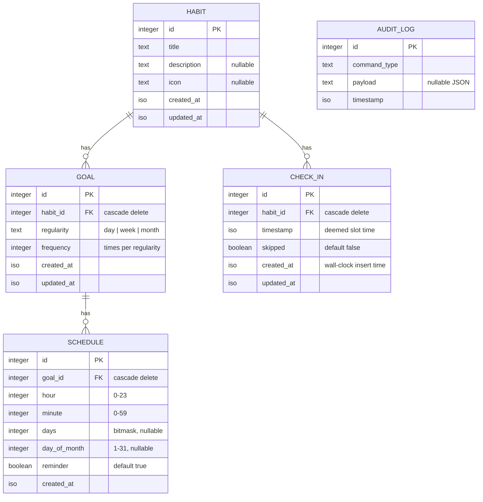

# Data Model

The app stores its data in a local SQLite database managed by Drizzle ORM.
Schema definitions live in [`packages/schema/src`](../packages/schema/src) and
relations in [`relations.ts`](../packages/schema/src/relations.ts).

## Schema Diagram

The diagram below is written in [Mermaid](https://mermaid.js.org/) — it
renders inline on GitHub and is still perfectly readable as plain text in the
source of this file.

`AUDIT_LOG` is intentionally drawn standalone — it records every command the
domain layer processes but has no foreign keys into the rest of the model.

## Tables

### `habit`

Source: [`habit.ts`](../packages/schema/src/habit.ts)

The thing you want to do. Title is required; description and icon are
optional. Created and updated timestamps are set automatically.

### `goal`

Source: [`goal.ts`](../packages/schema/src/goal.ts)

How often you want to perform a habit. `regularity` is one of `day`, `week`,
or `month`, and `frequency` is the number of times per that period (e.g.
`frequency = 3, regularity = "week"` reads as "3x weekly").

Constraints:

- `habit_id` references `habit.id` with `ON DELETE CASCADE`.
- Unique index on `(habit_id, regularity)` — a habit can only have one goal
  per regularity.
- Index on `habit_id` for lookup by habit.

### `check_in`

Source: [`checkIn.ts`](../packages/schema/src/checkIn.ts)

A record that a habit was performed (or explicitly skipped). Two timestamps
on each row, with deliberately distinct meanings:

- **`timestamp`** — the **deemed slot time**: which scheduled slot the
  check-in is credited to. For a normal "do it now" check-in this is the
  current moment. For a back-filled check-in (e.g. long-pressing a missed
  8 a.m. slot at 10 a.m.) this is the slot's time, not the moment of
  recording. The compliance counters, the slot-matching algorithm, and the
  per-day check-in lists all key off `timestamp`.
- **`created_at`** — the wall-clock time the row was inserted by the
  system. Always set automatically; callers can't override it. Compare
  against `timestamp` to tell whether a check-in was back-filled.

`skipped = true` marks the row as a deliberate skip rather than a
completion — a skip is treated by the compliance calculators the same way
as a real check-in, so explicit skips do not count against the
traffic-light indicator the way silent misses do. See
[`Intro.md` § Check-ins and skips](./Intro.md#check-ins-and-skips) for the
user-facing behaviour, including back-fill semantics.

Constraints:

- `habit_id` references `habit.id` with `ON DELETE CASCADE`.
- Indexes on `habit_id` and `timestamp`.

**Local retention.** Pull-sync prunes check-ins whose `timestamp` is
older than the start of the previous month (UTC) — but only when the
outbox is fully drained, so a check-in whose `CreateCheckIn` hasn't
been acknowledged is never dropped. Pruned periods are still queryable
on demand via the backend's per-period summary endpoints
(`/check-ins/monthly/{year}/{month}`,
`/check-ins/weekly/{year}/{month}/{day}`); see
[`Backend.md`](./Backend.md) for the projection details.

### `schedule`

Source: [`schedule.ts`](../packages/schema/src/schedule.ts)

When to remind the user about a goal. nag is not a calendar app, so
schedules are weekday-based: pick a time and a set of days of the week.

- `hour` / `minute` — time of day.
- `days` — bitmask of weekdays (nullable). Bits are defined in
  [`packages/core/src/days.ts`](../packages/core/src/days.ts):
  `Sun = 1, Mon = 2, Tue = 4, Wed = 8, Thu = 16, Fri = 32, Sat = 64`.
- `day_of_month` — specific day (1-31), nullable. Present in the schema and
  consumed by the monthly traffic-light calculator and notification
  scheduler, but **not currently exposed in the user-facing schedule
  editor** — user-defined schedules are weekday-only.
- `reminder` — whether a notification fires for this schedule (defaults to
  true). When several schedules share the same time slot with reminders
  enabled, the notifications are grouped into a single consolidated slot
  notification — see
  [`notificationConsolidator.ts`](../packages/core/src/notificationConsolidator.ts).

Constraints:

- `goal_id` references `goal.id` with `ON DELETE CASCADE`.
- Index on `goal_id`.

### `outbox`

Source: [`outbox.ts`](../packages/schema/src/outbox.ts)

Outbox queue for commands committed locally but not yet acknowledged by
the server. Each `processCommand()` call appends one row with
`status='pending'`; the dispatcher in `@nag/core` ships pending rows to
`POST /commands` and transitions them to `sent` (with the assigned
`server_sequence`) or `failed` (with `last_error`). `envelope_id` is the
idempotency key the server uses to dedupe retries.

**Sent-row retention.** Every successful `markSent` also deletes all
but the most recent `SENT_OUTBOX_RETAIN_DEFAULT` (10) sent rows in the
same transaction, so the outbox can't grow unbounded on long-lived
devices. Retained rows are useful only for debugging — the
high-water mark needed by pull-sync is mirrored into
`sync_state.highest_server_sequence`, and pending replays use
`envelope_id`.

The retention count is overridable at module load via the
`NAG_SENT_OUTBOX_RETAIN` env var; set it to `-1` to disable pruning
entirely (useful when investigating sync regressions where the full
outbox history matters).

## Relations

Drizzle relations are declared in
[`relations.ts`](../packages/schema/src/relations.ts):

- `habit` has many `check_in`s and many `goal`s.
- `check_in` belongs to one `habit`.
- `goal` belongs to one `habit` and has many `schedule`s.
- `schedule` belongs to one `goal`.

Deleting a habit cascades to its goals, check-ins, schedules (via goal), and
ultimately removes all dependent records.
